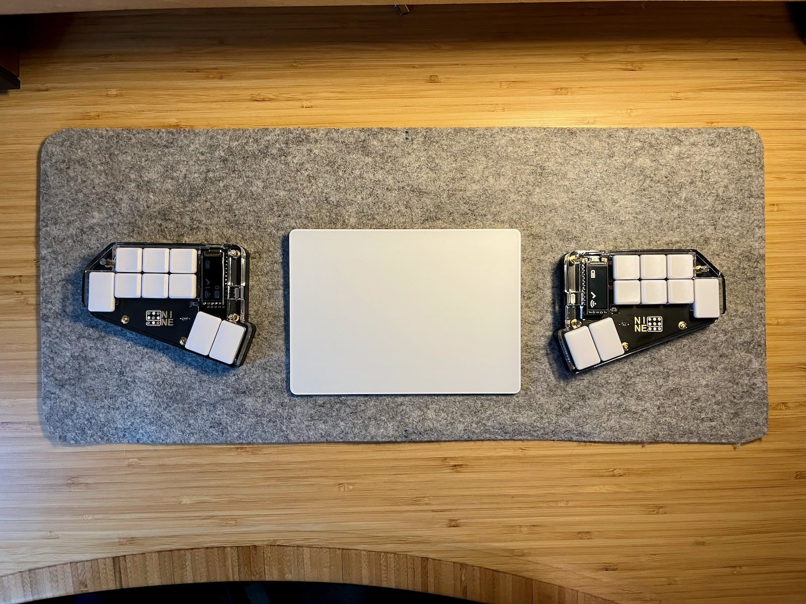

# Nine keyboard

The Nine is a tiny 18-key split, wireless, ergonomic split keyboard, heavily inspired by Ben Vallack's [Piano 2](https://www.pcbway.com/project/shareproject/The_Piano_by_Ben_Vallack_Ultra_minimal_18_key_keyboard_5b2c99e1.html). I tried out his design and loved it, but wanted to [tweak the physical layout](https://www.rousette.org.uk/archives/introducing-the-nine-keyboard/) a bit to fit my hands and my use case better. It uses Nice!Nano V2 BLE-equipped controllers, and (optionally) Nice!View displays to show information like the connected BLE profile, battery level and layer name.

Note that while I provide the `.stl` files for a case which fits the PCB here and works well, I will probably tweak the case (and possibly the PCB design) a bit in future to provide better protection for the displays and controllers, and also possibly provide more options for case designs. If/when I do that, I will add a 'v2' of the case and PCB if necessary here. I may also create a version using the Seeed XIAO BLE controller, which is smaller physically and also slightly cheaper to buy (which is why I have called this repo 'nine-nano'!) In the meantime, I have provided all the necessary source KiCad files and the [Shapr3D](https://www.shapr3d.com/) source files if you want to adapt either design.

## PCB

All the PCB files are [here](pcb/). If you want to fabricate and build the keyboard, the easiest route is to upload the [zip file containing the Gerbers](pcb/nine-nano-gerbers.zip) to a PCB fabrication house like [JLCPCB](https://jlcpcb.com/), [PCBWay](https://www.pcbway.com/), or [OSHPark](https://oshpark.com/). I have personally used the first two and both do a great job. I have heard that OSHPark is excellent too, and may be a cheaper/faster option if you are based in North America. I have written a [build guide](docs/build_guide.md) which should help you when soldering and assembling the board.

If you need information about how the board is wired up, PDFs of the [schematic](docs/nine_nano_schematic.pdf) and [PCB](docs/nine_nano_pcb.pdf) are provided, or you can open the [project](pcb/nine-nano.kicad_pro) in KiCad to alter the design yourself.

## Case

The `.stl` files needed to build the case, as well as the [Shapr3D source file](case/nine%20case.shapr) are in the [case](case/) directory. You will also find a file there with a basic 3D model of the PCB plus the main board components if you need a reference to build your own case. It's pretty bad though, as I couldn't figure out how to export the model with the surface-mounted components included. If you know how to impove this, please let me know --- it would have made designing the case much easier!

The [build guide](docs/build_guide.md) includes a section on getting the case printed and assembled too. Note that I have only got the case printed in resin, so I cannot guarantee that the tolerances etc. would be correct for printing in PLA or other materials. 

## Firmware

The [ZMK firmware](https://github.com/bsag/zmk-config-nine/) for this keyboard is in a separate repository, which you can fork if you would like to alter the keymapping. Instructions for downloading the firmware are in the [build guide](docs/build_guide.md). 

## Build guide

The build guide for the PCB and case can be found [here](docs/build_guide.md).

## Credits

As previously mentioned, this design is heavily inspired by Ben Vallack's [Piano 2](https://www.pcbway.com/project/shareproject/The_Piano_by_Ben_Vallack_Ultra_minimal_18_key_keyboard_5b2c99e1.html) and the layout he designed. I also used items from various repositories on Github for symbols and footprints to use in KiCad, such as [perigoso's keyswitch library](https://github.com/perigoso/keyswitch-kicad-library), [footstan's kbd library](https://github.com/foostan/kbd), and [crides kleeb library](https://github.com/crides/kleeb). 

The case design is my own, but I was hugely inspired by [Geist's TOTEM keyboard and case](https://github.com/GEIGEIGEIST/TOTEM), and his excellent build guide. Until seeing his case, I had no idea that you could print in transparent resin, which influenced a lot of my design decisions. He also has a beautiful build guide, which my poor illustration skills cannot hope to live up to!

Last but not least, I have asked a lot of questions and had invaluable advice from many people on the ZMK and Nice Keyboards Discords, including @petejohanson and @TweetyDaBird among others --- thanks for all who gave their time to help me, or who have open sourced their PCB designs, as this was really useful to check my work as I progressed with the designs ♥️. 

## Licence

This work is licenced with an [MIT license](LICENSE).