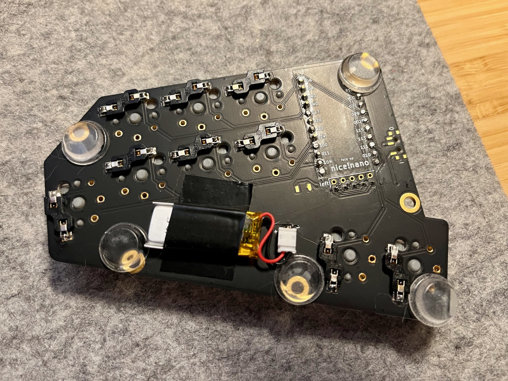

# Build guide for Nine Nano and case

## Keyboard

### Bill of materials for keyboard

| Item                                                                                | Quantity                        | Reference            | Buying suggestions                                                                         | Notes                                                                                                                                             | 
|-------------------------------------------------------------------------------------|---------------------------------|----------------------|--------------------------------------------------------------------------------------------|---------------------------------------------------------------------------------------------------------------------------------------------------| 
| Nine Nano PCB                                                                       | 2                               |                      |                                                                                            | Minimum order at fabrication houses tends to be 5 so you will have enough for 2 full keyboards plus one half spare for practice/soldering errors! | 
| JST connector ZH1.5mm 2 pin right angle                                             | 2                               | J1                   | [Aliexpress](https://www.aliexpress.com/item/1005002096347570.html)                                  | Get the kind which are described as ‘curved needle’ with the pins at right angles to the opening of the housing.                                  | 
| nice!view display (optional)                                                        | 2                               | J2, J3            |                                                                                            | Comes with header pins and socket (5 pins)                                                                                                        | 
| reset button - B3U-1000P                                                            | 2                               | RESET1               | [Aliexpress](https://www.aliexpress.com/item/1005002267741606.html)                                      |                                                                                                                                                   | 
| Kailh Choc v1 keyswitches (PG1350)                                                  | 18                              | SW1-SW9              | [Mechboards](https://mechboards.co.uk/products/kailh-choc-low-profile-pro-v1-pink)                       | Use whichever type of Choc switch you prefer - I used the Pink linear switch (20 gf)   | 
| Kailh Choc hotswap sockets                                                          | 18                              |                      | [Mechboards](https://mechboards.co.uk/products/kailh-choc-hotswap-sockets)                               |                                                                                                                                                   | 
| MBK or other Choc low profile keycaps that support choc spacing                     | 6 x 1.5U and 12 x 1U            |                      | [Splitkb](https://splitkb.com/collections/switches-and-keycaps/products/moergo-mcc-profile-1u-keycap) | I used MoErgo POM MCC-profile 1U and MoErgo POM MBK-Profile 1.5U convex caps                                                                |     
| power switch - MSK12C02 SMD Slide Switch (PCM12 footprint)                          | 2                               | SWF1                 | [Aliexpress](https://www.aliexpress.com/item/4000685483225.html)                                         |                                                                                                                                                   | 
| nice!nano v2                                                                        | 2                               | U1                   | [Mechboards](https://mechboards.co.uk/products/nice-nano-v2)                                             |                                                                                                                                                   | 
| sockets for nice!nano (optional but recommended)                                    | 4 x 12 pins                     | Mill Max low profile |                                                                                            | Manufacturer part no. 315-43-112-41-003000                                                                                                        | 
| round machine pins for sockets (optional but recommended) or trimmed off diode legs | 48 pins plus a couple of spares | Mill Max pins        |                                                                                            | Manufacturer part no. 3320-0-00-15-00-00-03-0                                                                                                     | 
| LiPo 3.7V batteries (at least 90 mAh)                                               | 2                               |                      |                                                                                            | I used 301228, but you can use any size that fits within a volume that is about 30 mm long x 20 mm wide x 6 mm thick.                           | 
| rubber bumpon feet                                                                  | ~12                             |                      |                                                                                            | To add to the base of the PCB to stabilise. Need to be >2 mm tall to clear the hotswap sockets                                                    | 
| USB-C cable | 1 | | |Used to charge each half of the keyboard via the Nice!Nanos.|

### Ordering PCBs

You can find the Gerber files you need to upload to a fabrication house in [this zip file](../pcb/nine-nano-gerbers.zip). Each fab house differs a bit, but you should be able to upload this zip file, then go with most of the default settings. The board is approximately 78.2 mm high x 105 mm wide with 2 layers, and you should choose 1.6 mm thick FR4 for the PCB. Quantity, colour and finish are up to you and how much you want to pay. You need 2 boards per complete keyboard, and they are reversible. I chose the matte black solder mask, white silkscreen and immersion gold (ENIG) finish, which I can really recommend, especially if you plan to use a transparent top case as I did. If you plan an opaque case, you could go with a cheaper option for solder mask and surface finish as it will not be visible once in the case. If you need to generate your own Gerber files after altering the design in KiCad, PCBWay has [instructions](https://www.pcbway.com/helpcenter/technical_support/Generate_Gerber_file_from_Kicad.html) which will give you some hints.

### Flashing firmware

1. Go to the [firmware repo](https://github.com/bsag/zmk-config-nine), then the Actions tab and click on the latest workflow run that has a green checkmark next to it. Download the firmware zip file.
2. Unzip the firmware file. Inside you will find a left and right `*.uf2` file and a settings reset file. You only need do use the latter if you have some problem and need to reset the bootloader.
3. Plug in the left side of the keyboard to your computer with a USB-C cable. If this is the first time you have flashed the controller, the blue LED on the controller should be flashing slowly, and a volume will mount itself on your computer. If you have flashed firmware to the controller before, you need to double-click the little reset button on the PCB to get the drive to mount. Drag the left firmware file (i.e. `nine_left nice_view_adapter  nice_view-nice_nano_v2-zmk.uf2`) on to the mounted drive. When it has finished copying, the volume will unmount. If you use macOS, the Finder may give you a notification that the drive was not unmounted cleanly. This is normal, don’t worry about it. 
4. Unplug the left half and plug in the right and repeat the procedure, this time dragging the right file (`nine_right nice_view_adapter nice_view-nice_nano_v2-zmk.uf2`) onto the mounted volume. 

**Note**, if you are using macOS Ventura, there is a bug with mounting the volume using Finder, so see [these instructions](https://zmk.dev/docs/troubleshooting#macos-ventura-error) for a work around.

You may want to fork my firmware repo and edit the [keymap file](https://github.com/bsag/zmk-config-nine/blob/main/config/boards/shields/nine/nine.keymap) to suit your own use. When you push your repository to Github, it will trigger the Actions workflow to build the firmware files and you can download and flash them from your own repository as above.

### Soldering the keyboard

Once you have your boards and components, you can start putting them together. First, a word about socketing the Nice!Nano controllers and the Nice!View displays. I would definitely socket the displays, as the headers and sockets to achieve this are included in the package, and their fragility means that you will probably want to remove them temporarily if you have to reflow any solder or test pins on the controller. Socketing the controllers is also highly recommended, because it means that you can more easily remove the controllers to test them in isolation from the board in case of issues, and you can reuse them on a new board if you wish. However, I chose to use the included headers that came with the Nice!Nanos and solder them to the board rather than socketing. It’s a risk, but a) I do have a desoldering gun, and b) I could only get slightly taller Mill Max sockets (not the models specified in the table above). If I had used the the sockets I had, the controller would sit just slightly too high so that the components of the controller would clash awkwardly with those on the Nano. I think it would have worked, but I felt more comfortable with a bit of a gap between.

Even if you do choose to socket the controllers, it is a good idea to flash the firmware to the controllers before you get the soldering gun out to make sure that they mount and flash correctly. See the section on [firmware](build_guide.md#flashing-firmware) for instructions, and make sure that you put each half back in the packet it came with for now, labelled clearly with 'left' or 'right' depending on which firmware you flashed on each one.

There isn't any particular arder in which to solder the components, but this is the order in which I did things, completing the left half first so that I could test it (the right side will not operate on its own). I would advise laying out the two halves in their correct orientation and labelling the front of each side with a bit of masking tape with 'left' or 'right' to avoid later confusion. Some components are soldered to the back of the board and some to the front, and as the boards are reversible, it is easy to get confused.

I also used isopropyl alcohol and a cotton swab, old toothbrush, or soft kitchen paper to clean excess flux off the board after each step, as I find it easier to access the PCB like this, but it is also possible to clean the whole thing up at the end.

1. Solder the hotswap sockets for the key switches. These go on the **back** of the board. Fit the bumps on the back of the one of the sockets into the holes at the top of a switch footprint so that the metal pads line up with the surface mount solder pads. The sockets on the thumb and pinkie keys are rotated 90° anti-clockwise on the left half. Once you have checked that you have things oriented correctly, add a blob of solder to one side of each of the pads. If you have some liquid flux, it helps to add a little to each of the pads before you do this. Line up the socket and gently push down with a pair of tweezers as you heat both the metal contact and the solder blob/pad you added earlier with the iron. You should feel the socket bump into place and sit flush with the board. Repeat with all of the remaining sockets, and the solder the remaining side of the sockets for all the switches. While doing this, ensure that you touch both the pad and the metal contact while you feed in solder, but don't add too much. It needs to be firmly anchored and make good electrical contact, but if you add too much it can block the holes that the switch legs go into.
2. Solder reset switch and the power switch. Both go on the **front** of the board. You can use a similar technique as with the hotswap sockets to seat the switch correctly befor soldering all the pads.
3. Tape the nice!view sockets to the **front** of the board and solder. Make sure that they are vertical and fully inserted, then solder just the corner pins (from the back of the board) before checking your work. Melt the solder and reposition if they have gone a bit wonky. Solder the rest of the pins. Place tape over the openings of the sockets and push a machine pin into each hole through the tape (the tape prevents excess solder from getting into the socket). If you use the flat side of a pair of tweezers to gently push in the pin, you should feel a click as it is seated fully. Next, place the Nine!Nano on the pins, making sure you have the unit for the appropriate side if you have already flashed the firmware. Note that the holes on each side nearest the USB connector should **not** be used. Note also that the components should be **face up** on the left half of the keyboard, and **face down** on the right half. This is very important (you could damage your controllers if you have it wrongly oriented), so cross-check with the labels for the RAW pin on board and PCB silkscreen on each half to make sure that you have the board oriented the right way. Solder the pins to the Nice!Nano. Once cooled, carefully remove the controller, using something flat to lever it up gradually from each end, and taking care not to damage any of the components. Remove the tape from the sockets and set the controller safely aside for now.
4. Fit the JST socket and trim the pins on the top of the board so they are flush. These go on the **back** of the board, and in order to keep the positive pin on the left of the connector, orient so that the open side faces the back edge of the board on the left half, and the open side faces the front edge on the right half. Double check that his is correct with the '+/-' silkscreen on the underside of the board. Solder the pins from the top side of the board, being very careful not to create a short between the pins as they are very close together.
5. Insert the controller back in the sockets and do some testing with a multimeter. Make sure that you have continuity between the positive (+) pin of the JST and the RAW pin of the controller, and then the negative (-) pin of the JST and the GND pin (next to RAW) on the controller. Note that the two GND pins that are next to each other are not connected. Test the power switch and reset button connections in a similar way (use the [schematic](nine_nano_schematic.pdf) if you are unsure about how the pins should be connected), and check everything for shorts.
6. Insert the switches, connect the keyboard half to your computer and test that the keys work (you will have to flash the controller with the firmware first if you have not already done so).
7. Repeat with the right half of the keyboard (but you will not be able to test the keys yet).
8. Add the connector plug to the battery wire, checking and triple checking that the red (positive) wire connects to the positive pin of the JST and the black wire to the negative on both halves of the keyboard. Handle the batteries with great care: do not let the bare wires (or wires with the metal contacts added) touch one another, and do not squash or pierce the body of the battery. Once you are sure that everything is wired up correctly, plug in the batteries, replace the displays in their sockets if using, and test with the left half connected via USB. If the batteries need charging first, plug each half in using a USB-C cable, and ensure that the orange light on the controller comes on to indicate charging (the power button should be in the on position). The light will go out once the battery is fully charged. Tape the battery to the underside of the PCB securely using electrical tape.
9. Once you are sure that it works when connected via USB and the batteries have sufficient charge, unplug and try connecting via Bluetooth. See the [ZMK guide](https://zmk.dev/docs/behaviors/bluetooth) for details on how to pair the keyboard with your device. You can study the keymap in the [firmware repo](https://github.com/bsag/zmk-config-nine) for more details, but the Bluetooth layer is accessed through a tap combo to toggle the layer. On the Symbol1 layer (i.e. holding the left middle finger on the bottom middle key), quickly tap the right middle and ring finger keys on the bottom row of the right side, then let go of all keys. If you have the displays installed, you will see the layer name change on the left hand display change to 'BT'. Using the keymap guide, tap the BT CLR button, then the BT0 key to choose profile 1. Tap the left-most thumb key on the left half (AL1) to return to the base layer. You should then be able to use the Bluetooth settings on your device to find the keyboard (labelled as 'Nine') and connect to it. Once connected, both displays should show a check mark and a wireless symbol. You can connect to up to 5 devices by repeating the process, but choosing BT1, BT2 etc. When you want to switch the keyboard to connect to another device that you have previously set up, enter the BT layer as previously described, tap the appropriate profile button for the pairing and return to the base layer.
10. Add keycaps.
11. If you are using the keyboard without a case, put some rubber bumpons/feet on the bottom to raise the hotswap sockets and batteries off the surface of the desk. I would also try to rig up something more rigid to prevent accidental piercing of the battery from underneath. You may also want to put a piece of electrical tape over the protruding pins for the JST connector, to avoid accidentally shorting them with something metal. If you use the case I designed, the pins sit in a 'bubble' of resin and and and are therefore isolated from any contact. This may be a bit excessive, but LiPo batteries can be very dangerous if shorted!

## Case

**Note**: I have some minor things that I want to fix with the case, though it fits perfectly fine and works well. I have only tried getting it printed in resin, so I don't know if the tolerances would work for other forms of 3D printing like PLA. If you get it printed in resin, you may be told that there are very thin spots around the hole for the screw nearest the thumb keys. I got the warning, but the print turned out fine for me with no cracks or other issues. It may not work out as well for you depending on the service you choose. Just be aware of the issues.

The case is composed of a top and bottom half for each side, which I designed to be 3D printed in resin. Since I got a gorgeous matte black solder mask with immersion gold (ENIG) finish from PCBWay, I wanted to show that off rather than hiding it. I therefore chose a black resin base (to hide the battery and wires underneath) and a transparent resin top. You could print both halves in opaque resin or both in transparent if you like. The files to upload to the service you use are the `.stl` files in the [case](../case/) directory. I used a sheet of cork in the bottom of the bottom half of each side to improve the sound and dampen any ringing from key presses, but this is optional. Foam sheet would probably also work for this purpose.

### Bill of materials for the case

| Item                                                                                                                                                                                                                                                                                                                                                                                 | Quantity                      | Notes                                                                                                                                                                                                                                                | 
|--------------------------------------------------------------------------------------------------------------------------------------------------------------------------------------------------------------------------------------------------------------------------------------------------------------------------------------------------------------------------------------|-------------------------------|------------------------------------------------------------------------------------------------------------------------------------------------------------------------------------------------------------------------------------------------------| 
| case bottoms                                                                                                                                                                                                                                                                                                                                                                         | 2                             | I used black resin                                                                                                                                                                                                                                   | 
| case tops                                                                                                                                                                                                                                                                                                                                                                            | 2                             | I used transparent resin                                                                                                                                                                                                                             | 
| 8 mm M2 standoffs                                                                                                                                                                                                                                                                                                                                                                    | 10                            | Brass/gold colour looks nicest if you go for the immersion gold finish on the PCB.                                                                                                                                                                   | 
| ~5-6 mm M2 screws                                                                                                                                                                                                                                                                                                                                                                      | 20                            | This is the fairly standard size that seems to come with most kits.                                                                                                                                                                                  | 
| ~3mm thick cork sheet                                         |1 x A4 sheet would be plenty |*Optional to deaden sound*. Foam or another similar material would also work. There is 6.5 mm space under the PCB and the hotswaps are about 2mm deep, so you can choose the thickness of your material depending on the thickness of your battery. | 
| Sugru (colour of your choice) to fill the grooves on the base, or rubber bumpons (~12) |1 or 2 x 3.5 g packs         |*Optional.* You can use the base without filling the grooves, but the intention is to fill them just proud of the base with Sugru so that they provide non-slip feet without adding much extra height.   | 

### Construction of the case

1. Putting it together is fairly easy. You need a long skinny screwdriver to fit in the deep holes for the standoffs at the top of the board. If you have already test assembled your PCB, remove the Nice!View displays if using, and remove the keycaps and switches.
2. Insert all the standoffs into the supports for the bottom of the case, and use 5 of the screws in the base of the case to secure. Don’t over-tighten any of the screws or you may crack the case. Cut the cork sheet (if using) to size using a spare PCB as a template, and push into the bottom of the case.
3. Place the PCB on on the bottom case. The standoffs should just fit through the holes in the board and sit flush with the top surface of the board. Check that everything lines up nicely. The top of the board should also sit flush with the outer wall of the bottom case.
4. Take the upper case for this half and very carefully insert a couple of switches into the plate (e.g. the inner thumb and the top outer key in the main block). Do this gently, taking care not to bend the top case as you do so. They should click in without too much force. 
5. Line up the top case with the PCB (removed for now from the bottom case). Gently press the switches into the hot swap sockets, supporting the sockets from underneath as you do so. Once you are happy that these switches are properly seated and the PCB is level and flush with the underside of the switch plate, insert the remaining switches. The case should sit properly over the solder bumps of the JST socket and reset switch.
6. Place the top case and PCB on top of the bottom case and adjust gently to ensure that the two halves meet up correctly. Finally, screw the top case to the bottom using 5 more screws. Gently tighten.
7. Replace the keycaps and the Nice!View, and then repeat the procedure with the other half.
8. Power it up and check that everything is working, and celebrate with some Monkeytype sessions!

Optional: You can use Sugru to fill the grooves on the bottom surface of the case to provide grippy strips without adding height. Follow the instructions on the packet to knead and prepare the Sugru, then roll it into thin snake shapes, and press down into the grooves to fill all the gaps. Scrape the surface smooth and level with the base so that the grooves are flush. Place your keyboard halves upside down on a soft surface while the Sugru hardens (12-24 hours). I did this, but the strips are not really thick or grippy enough if you use the keyboard on a desk with a smooth surface. I would not bother doing this part, and instead use rubber bumpons, perhaps cutting them down to fit in the grooves. Note that if used on a keyboard mat (I use a homemade felt one), there is no problem with the keyboard slipping, even without bumpons.

